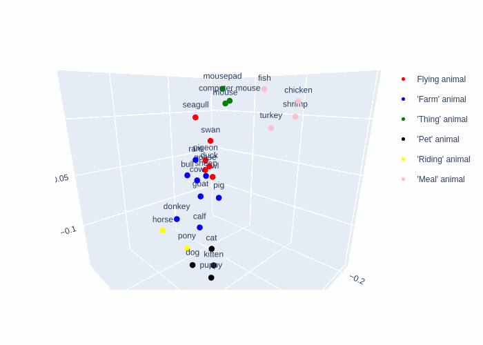

# ComputationalSemantics

A demo of two projects from the Computational Semantics course in Intelligent Interactive Systems @ Universitat Pompeu Fabra

- embedding_visualization.ipynb: Visualization and analysis of CLIPs object prototypes that encode human biases
- rumoureval_task_3_SDQC_classification.ipynb: A simple implementation of [SemEval's 2019 RumourEval task 3](https://aclanthology.org/S19-2147/) of a `Support`, `Deny`, `Query`, `Comment` classifier of Twitter and Reddit replies to posts about rumours. The system is implemented via the `flair` NLP library, using either a DeBERTA-v3-base model with a classifier adapter or a GRU-based classifier using GloVe and character-level embeddings as its embeddings source. The system is exclusively trained on the RumourEval dataset and doesn't rely on external information. We also analyzed different sample creation techniques regarding the context to be provided, namely:
    - Add the reply's depth 
    - Add the main post/Twitter thread title/contents
    - Add the comment the reply is answering to

Developed alongside Eder Ruiz and Stephen Buttner
